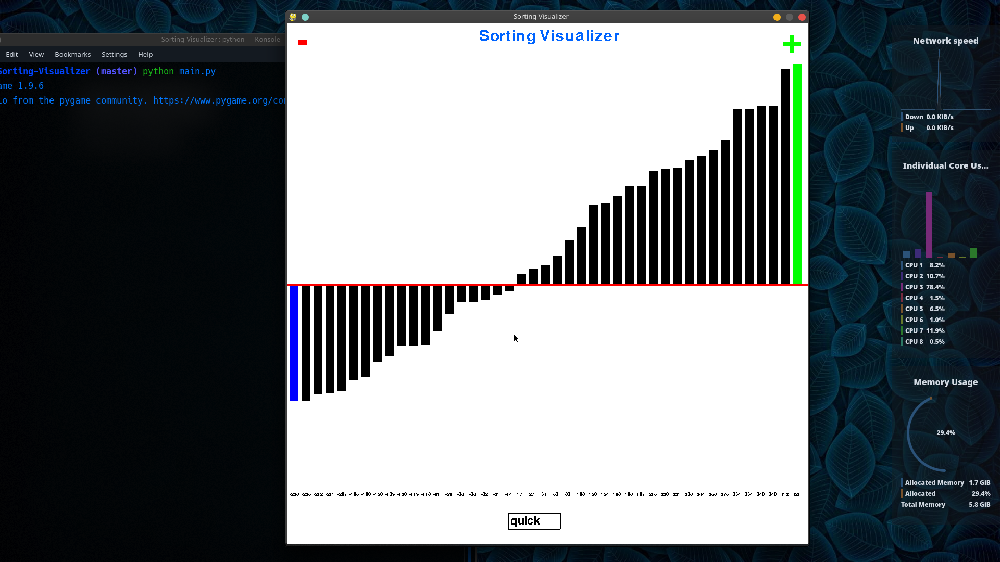

# Sorting Visualizer

### Available Algorithms
1. Bubble Sort
2. Selection Sort
3. Insertion Sort
4. Quick Sort

### Working 
1. Insert algorithm name into the text field **AND** press ` ENTER `
 + Available options :  ``
    bubble, selection, insertion, quick
    ``
    
2.  Press ` Space ` button to `RUN`
 
3.  Press `r` to `RESTART` 

### Who am i 

